# APPROVAL SYSTEM

Application of claim insurance simulation. 


| stack | technology | 
| -------| ------------|
| backend | python (fastapi) | 
| frontend | vue (nuxt) |
| database | postgres | 
| dev tools | docker-compose | 


## How to setup application 
this setup expected to have experience of programming and already have node,  python and docker on the machine. 

### Setup the database 
```bash 
# run to create the postgres database on local 
docker-compose up -d
```

### setup the backend 
```bash
# move to backend directory 
cd backend

# copy the environment 
cp .env.example .env

#crete the env 
python3 -m venv .venv

# install the dependency 
pip install -r requirements.txt // or pip3 install -r requirements.txt

# activate the env
source ./.venv/bin/activate

# run the create migration command
alembic revision --autogenerate -m "init_data"

# run the migration 
alembic upgrade head

# run the application 
uvicorn app.main:app --host 0.0.0.0 --port 8000 --reload
```

### setup the frontend 

```bash
# move to frontend directory 
cd frontend

# copy the environment 
cp .env.example .env

# install the dependency
npm install

# run the application 
npm run dev
```

## seed user data 

After the seeding, the system can login with this account. 

| user email | password | 
| -----------| ----------|
| admin@example.com | Asdqwe123@ | 
| verifier@example.com | Asdqwe123@ | 
| user@example.com | Asdqwe123@ | 
| user2@example.com | Asdqwe123@ | 


## business logic 

The business logic cover on this app is about claim insurance system. on the system it's will contain sequence of process start from creating the claim, verified then approve it. 

Then the way to run the positive case of the application is 

1. login as a user to the application with email and password, it can used the payload from the credential above or register new one then login with it 

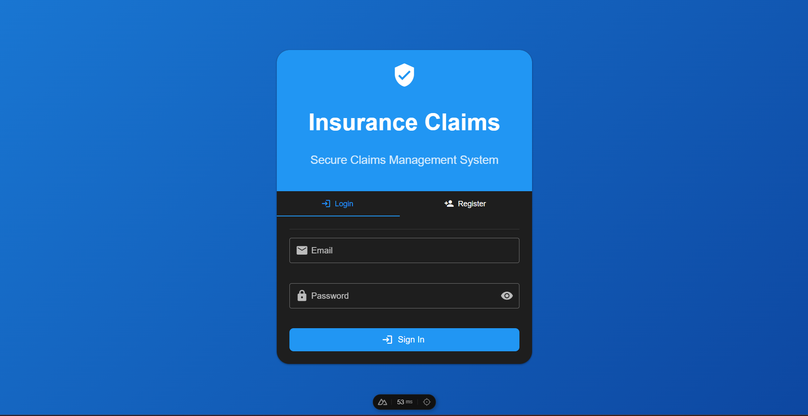

2. after login, the user will see table of claim insurance, then for crete the new claim insurance, there will be a button of create new insurance. 

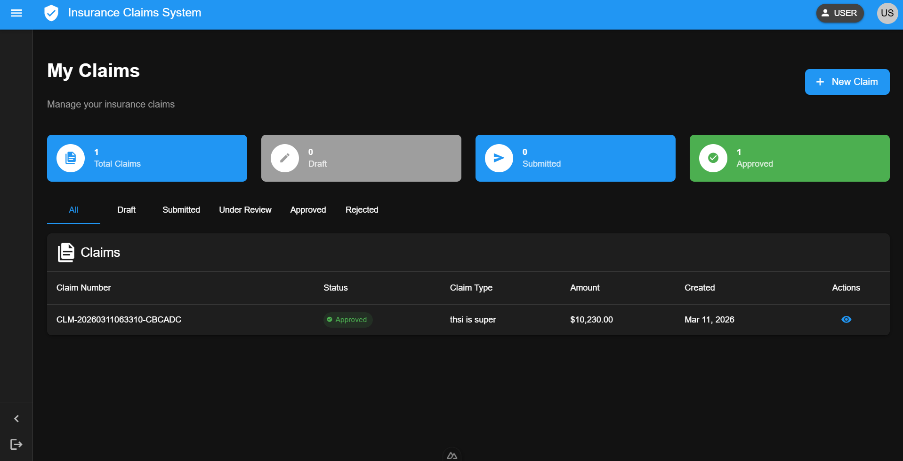

3. when the button create new insurance click, the model of list of insurance will listing, select the insurance want to claim then click crete claim

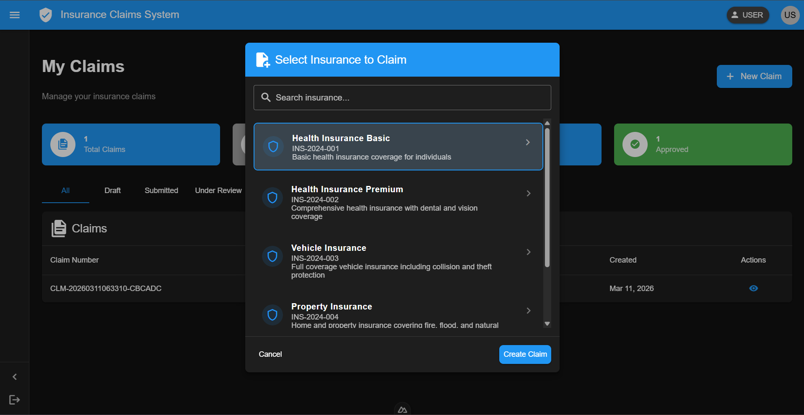

4. after the claim create, user will get direct to the form. this form need to filled before it's get submitted. 

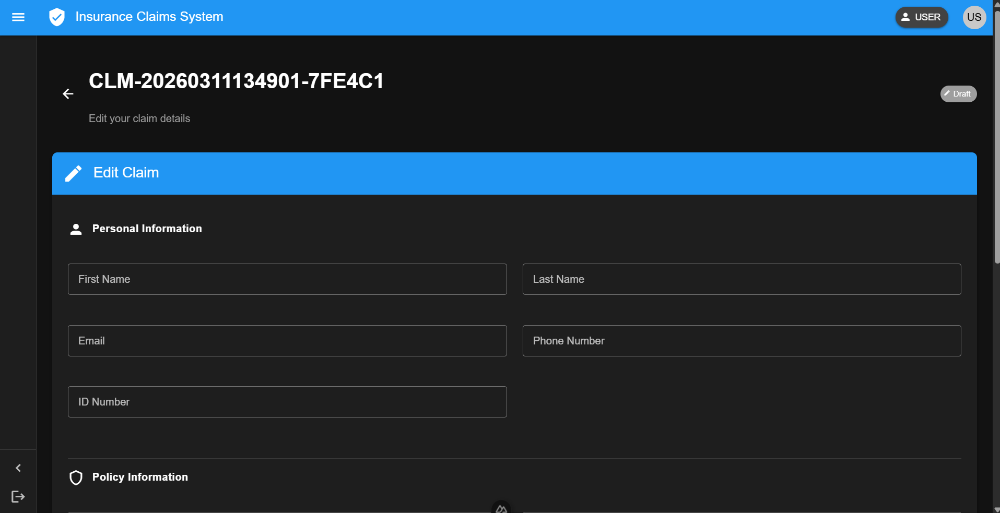

5. on the very end of the form have button to draft the claim or submit the form 

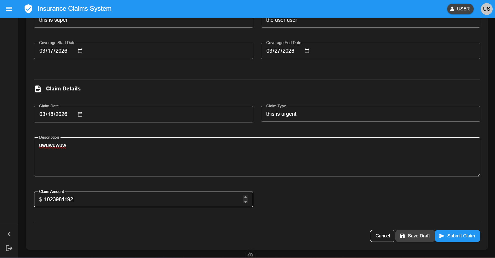

6. after get submitted the insurance claim cannot get update by user. then user need to wait until the claim get process

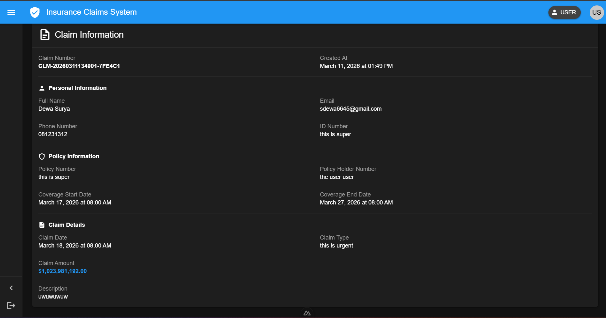

7. Login as verifier to process the claim, on the table there is an icon, click the icon then it will move to page to the verifier page. 

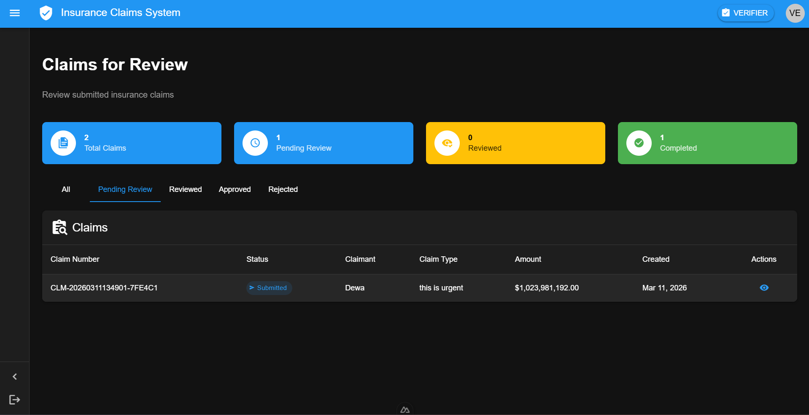

8. on the verified page, verifier need to submit the summary to verified the claim 

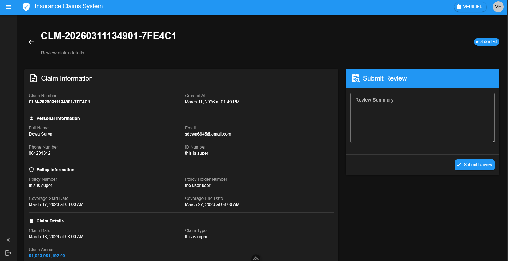

9. the after the claim get verified, login as admin, then on the admin page 

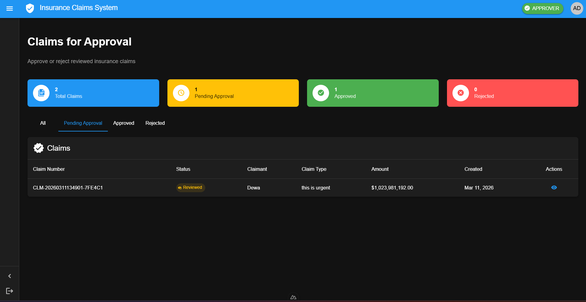

10. on the approve page the approver can decide do it's approve or rejected. 

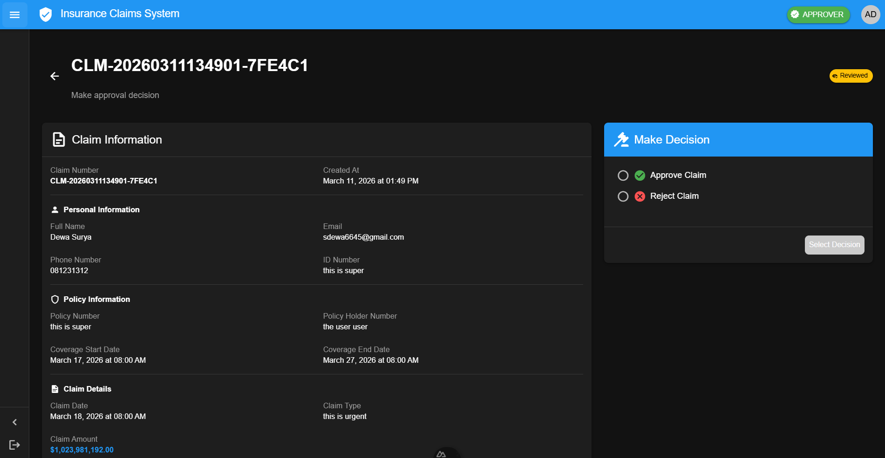

11. then after the claim insurance approved the process is done. 

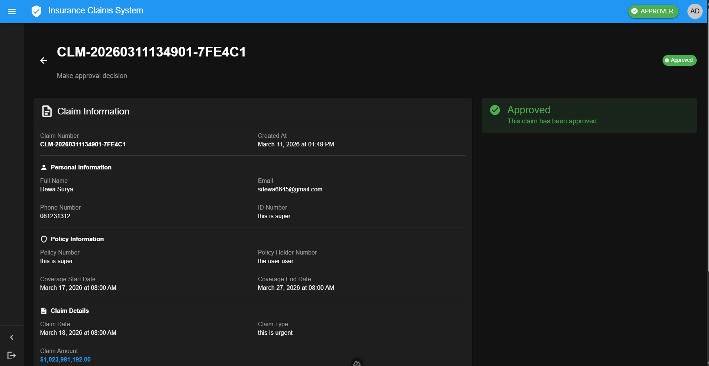


## Authors

- [@DewaSRY](https://www.github.com/DewaSRY)